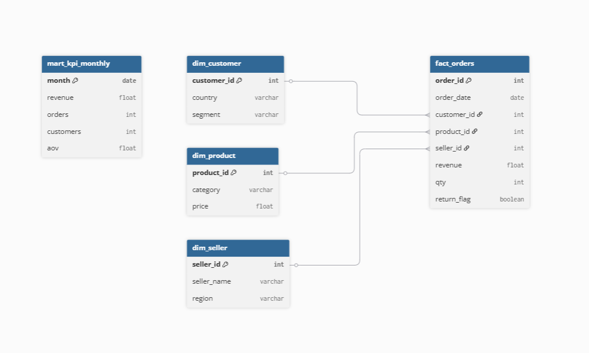

# 🚀 AI Executive KPI Intelligence Micro-SaaS


> Built as a **Product-Grade AI Analytics Backend** demonstrating  
> Data Engineering, Backend Architecture, and Decision Intelligence design.
> Ask questions like **"Why did performance drop?"** and receive automated driver analysis, risk signals, anomaly detection, and executive-ready AI insights.

An AI-powered analytics backend that transforms natural language questions into KPI analysis, business drivers, and decision intelligence using a **Micro-SaaS product architecture**.

---

# 🧠 AI Executive Decision Intelligence Engine

This system simulates a modern AI analytics product that automatically:

- Detects KPI intent from natural language
- Generates dynamic SQL queries
- Performs driver decomposition
- Calculates risk signals
- Produces executive narratives
- Detects KPI anomalies
- Runs what-if simulations
- Supports async AI jobs

---

## ⚡ AI Insight Pipeline

```
User Question
→ Agent Intelligence
→ KPI Driver Analysis
→ Decision Engine
→ Executive Report
```

---

# 🏗️ Architecture

```
Client
↓
FastAPI Product API (/v1/*)
↓
Agent Intelligence Router
↓
Dynamic SQL Builder
↓
PostgreSQL KPI Warehouse
↓
Driver Decomposition Engine
↓
Decision Signal Engine
↓
Executive Report Formatter
```

---

## Backend

- FastAPI
- Python
- Pydantic v2

## Data Layer

- PostgreSQL
- Dynamic SQL Builder

## AI / Decision Intelligence

- Agent Intelligence Engine
- Driver Decomposition Service
- Risk Scoring Engine
- Executive Narrative Generator
- KPI Anomaly Detection
- What-If Simulation Engine

## Infra

- Docker
- Docker Compose
- API Key Security

---

# 🖼️ Product Demo Screenshots

## 🚀 API Swagger Overview

.png)

---

## 🧠 Executive Insight Endpoint


---

## 🐳 Docker Runtime


---

# 🔐 Product API (v1)

All production endpoints live under:

```
/v1/*

```

Requires:

```
X-API-Key
```

Swagger → Authorize 버튼 사용.

---

# 🤖 AI Analytics Engine

## Primary Entry

```
POST /v1/agent/query
```

Natural language → Executive AI analysis.

Returns:

- driver_summary
- decision signals
- executive report

---

## Executive Narrative Only

```
POST /v1/ask-executive
```

Clean CFO-style output.

---

## 🧠 Debug Trace (Product-grade)

Shows:

- routing mode
- fallback decision
- agent execution trace

(No chain-of-thought exposed)

---

## 📈 Explain KPI Drivers (No LLM)

```
GET /v1/agent/explain
```

Rule-based KPI breakdown.

---

## 🚨 Auto Insight Detection

```
POST /v1/agent/insight
```

Detects KPI anomalies.

---

## 🔮 What-If Simulation

```
POST /v1/agent/simulate
```

Revenue ≈ Orders × AOV scenario testing.

---

# ⚡ Async AI Jobs (Senior DE Feature)

## Submit Async Query

```
POST /v1/agent/query-async
```

Returns:

```
job_id
```

---

## Poll Job Result

```
GET /v1/jobs/{job_id}
```

Simulates production AI background processing.

---

# 📊 Dashboard Endpoint (Frontend Ready)

```
GET /v1/dashboard
```

Provides:

- KPI tiles
- trend summary
- alerts
- risk signals

Designed for frontend MVP integration.

---

# 🎬 Demo Flow

## 1️⃣ Seed KPI Data

```
POST /v1/seed-demo
```


---

## 2️⃣ Ask Executive AI

```
POST /v1/ask-executive
{
"question": "Why did performance drop?"
}
```

---

## 3️⃣ Detect KPI Risk

```
POST /v1/agent/insight
{}
```

---

## 4️⃣ Run What-If Simulation

```
POST /v1/agent/simulate
{
"orders_delta_pct": 0.1
}
```

---

# 🐳 Run with Docker

```
docker compose up --build
```

Swagger:

```
http://localhost:8000/docs
```

---

# 🎯 Why This Project Matters

Modern analytics platforms are evolving into **Decision Intelligence Systems**.

This project demonstrates:

- AI Agent-driven analytics
- Executive-level KPI reasoning
- Product-grade FastAPI architecture
- Async AI job processing
- Frontend-ready API design
- Micro-SaaS backend system

---

# 🧩 Designed For

- AI Backend Engineering
- Data Engineering (API-first analytics)
- Decision Intelligence Systems
- Micro-SaaS Architecture

---

# 🧠 Positioning

```
BI Dashboard → AI Analytics Engine → Decision Intelligence SaaS
```

---

# 🔎 API Examples

### Example 1) Executive KPI Explanation

**Request**

```
curl -X POST "http://localhost:8000/v1/ask-executive" \
  -H "Content-Type: application/json" \
  -H "X-API-Key: test" \
  -d '{
    "question": "Why did revenue drop last month?"
  }'
```

**Response**

```
{
  "answer": "Revenue declined primarily due to fewer orders, while average order value remained relatively stable.",
  "driver_summary": {
    "primary_driver": "orders"
  }
}
```
### Example 2) What-If Simulation

**Request**

```
curl -X POST "http://localhost:8000/v1/agent/simulate" \
  -H "Content-Type: application/json" \
  -H "X-API-Key: test" \
  -d '{
    "orders_delta_pct": 0.10
  }'
```

**Response**

```
{
  "baseline": {
    "orders": 12400,
    "aov": 58.2,
    "revenue": 721680
  },
  "scenario": {
    "orders": 13640,
    "aov": 58.2,
    "revenue": 794848
  },
  "delta": {
    "orders": 1240,
    "revenue": 73168
  }
}
```


---

## 🗺️ Data Model (ERD)



### Core Tables

**mart_kpi_monthly**
- month (PK)
- revenue
- orders
- customers
- aov

**fact_orders**
- order_id (PK)
- order_date
- customer_id
- product_id
- revenue

**dim_customer**
- customer_id (PK)
- country
- segment

**dim_product**
- product_id (PK)
- category
- price

---

# 📂 Project Structure

```
AI-Executive-KPI-Intelligence-Micro-SaaS/
├── .github/workflows/   # CI/CD workflows
├── api/                 # FastAPI app and backend logic
├── db/                  # Database scripts and initialization files
├── docs/                # ERD, architecture diagrams, and project docs
├── screenshots/         # Project screenshots for README/demo
├── tests/               # Test cases
├── .gitignore
├── README.md
├── docker-compose.yml   # Multi-container local setup
└── requirements.txt     # Python dependencies
```
