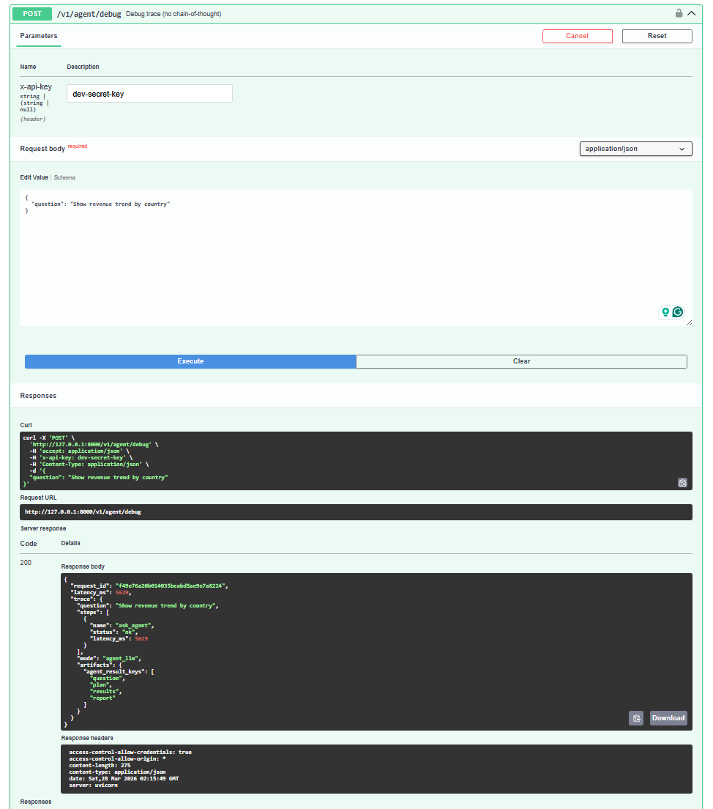
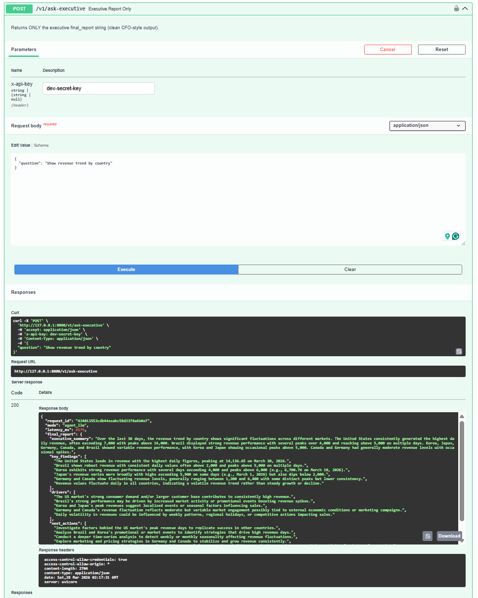
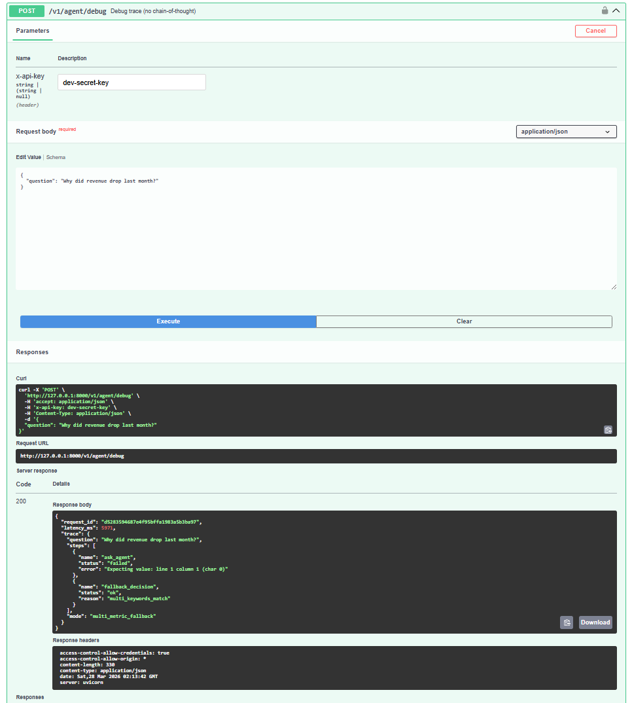
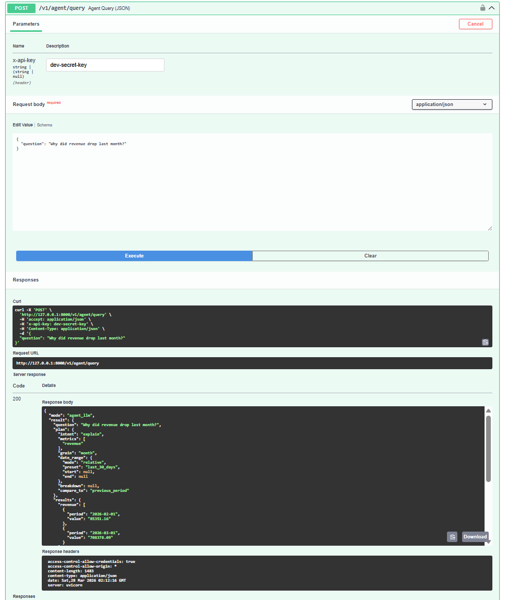
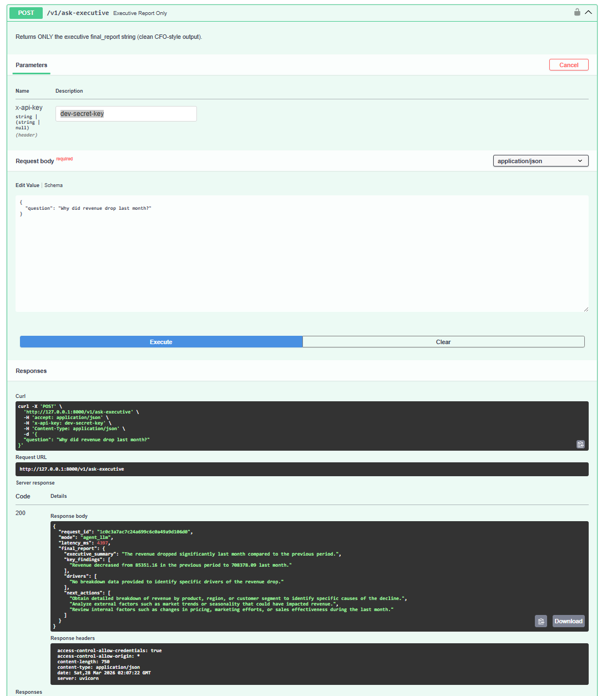

# 🚀 AI Executive KPI Intelligence Micro-SaaS


> Built as a **Product-Grade AI Analytics Backend** demonstrating  
> Data Engineering, Backend Architecture, and Decision Intelligence design.

Ask questions like **"Why did performance drop?"** and receive automated driver analysis, risk signals, anomaly detection, and executive-ready AI insights.

---

# 🧨 What Makes This Different

Unlike traditional BI dashboards or simple LLM demos, this system:

- Combines deterministic data pipelines with LLM reasoning
- Executes real SQL queries instead of hallucinated outputs
- Implements fallback decision logic when AI parsing fails
- Produces structured analytics BEFORE generating narratives
- Simulates a production-grade AI analytics backend

👉 This is not a chatbot.  
👉 This is a **Decision Intelligence System**.

---

# 🧠 AI Executive Decision Intelligence Engine

This system simulates a modern AI analytics product that automatically:

- Detects KPI intent from natural language
- Generates dynamic SQL queries
- Performs driver decomposition
- Calculates risk signals
- Produces executive narratives
- Detects KPI anomalies
- Runs what-if simulations
- Supports async AI jobs

> ⚠️ Note:  
This system does NOT rely purely on LLMs.

- Core analytics are SQL-driven  
- KPI computations are deterministic  
- LLM is used only for interpretation and narrative generation  

This ensures reliability and prevents hallucinated business insights.

---

## ⚡ AI Insight Pipeline

```
User Question
→ Agent Intelligence
→ KPI Driver Analysis
→ Decision Engine
→ Executive Report
```

---

# 🏗️ Architecture


---

## 🧱 System Design Highlights

- Microservice-style API architecture
- Separation of concerns (Agent / SQL / Decision Engine)
- Stateless API layer for scalability
- Pluggable LLM + rule-based hybrid system
- Production-style fallback handling

---

## Backend

- FastAPI
- Python
- Pydantic v2

## Data Layer

- PostgreSQL
- Dynamic SQL Builder

## AI / Decision Intelligence

- Agent Intelligence Engine
- Driver Decomposition Service
- Risk Scoring Engine
- Executive Narrative Generator
- KPI Anomaly Detection
- What-If Simulation Engine

## Infra

- Docker
- Docker Compose
- API Key Security

---

# 🖼️ Product Demo Screenshots

## 🚀 API Swagger Overview

.png)

---

## 🧠 Executive Insight Endpoint


---

## 🐳 Docker Runtime


---

# 🔐 Product API (v1)

All production endpoints live under:

`/v1/*`

Requires:

```
X-API-Key
```

Swagger → Use the **Authorize** button

---

# 🤖 AI Analytics Engine

## Primary Entry

```
POST /v1/agent/query
```

Natural language → Executive AI analysis.

Returns:

- driver_summary
- decision signals
- executive report

---

## Executive Narrative Only

```
POST /v1/ask-executive
```

Clean CFO-style output.

---

## 🧠 Debug Trace (Product-grade)

Shows:

- routing mode
- fallback decision
- agent execution trace

(No chain-of-thought exposed)

---

## 📈 Explain KPI Drivers (No LLM)

```
GET /v1/agent/explain
```

Rule-based KPI breakdown.

---

## 🚨 Auto Insight Detection

```
POST /v1/agent/insight
```

Detects KPI anomalies.

---

## 🔮 What-If Simulation

```
POST /v1/agent/simulate
```

Revenue ≈ Orders × AOV scenario testing.

---

# ⚡ Async AI Jobs (Senior DE Feature)

## Submit Async Query

```
POST /v1/agent/query-async
```

Returns:

```
job_id
```

---

## Poll Job Result

```
GET /v1/jobs/{job_id}
```

Simulates production AI background processing.

---

# 📊 Dashboard Endpoint (Frontend Ready)

```
GET /v1/dashboard
```

Provides:

- KPI tiles
- trend summary
- alerts
- risk signals

Designed for frontend MVP integration.

---

# 🎬 Demo Flow

## 1️⃣ Seed KPI Data

```
POST /v1/seed-demo
```


---

## 2️⃣ Ask Executive AI

POST /v1/ask-executive

Request Body:

{
  "question": "Why did performance drop?"
}

---

## 3️⃣ Detect KPI Risk

POST /v1/agent/insight

Request Body:

{}

---

## 4️⃣ Run What-If Simulation

POST /v1/agent/simulate

Request Body:

{
  "orders_delta_pct": 0.1
}

---

# 🧪 Real API Execution Proof (End-to-End AI Pipeline)

This section demonstrates **real execution of the AI analytics pipeline** using Swagger UI.

It validates:

- Full pipeline execution
- Agent routing behavior
- SQL-driven analytics
- Executive-level output generation

---

## 🔍 Scenario 1: Revenue Trend by Country

### 1️⃣ Debug Trace (Agent Routing)



- Agent routing executed successfully
- Mode: `agent_llm`
- Pipeline initialized with correct intent

---

### 2️⃣ Agent Query (Structured Analytics Output)


- Generated structured plan:
  - intent: `trend`
  - metric: `revenue`
  - breakdown: `country`
- Returned time-series KPI data

---

### 3️⃣ Executive Report (Final AI Output)



- CFO-style narrative generated automatically
- Key insights:
  - US highest revenue contributor
  - Germany/Canada variability
  - Korea/Japan stable trends
- Actionable recommendations included

---

## 🔎 Scenario 2: Revenue Drop Analysis

### 1️⃣ Debug Trace (Fallback + Decision Logic)



- Initial agent parsing failed
- Fallback triggered: `multi_metric_fallback`
- Decision engine handled ambiguity correctly

---

### 2️⃣ Agent Query (Comparative KPI Analysis)



- Intent: `explain`
- Comparison: `previous_period`
- Output:
  - revenue decreased from 83,531 → 70,878

---

### 3️⃣ Executive Report (Final Business Insight)



- AI-generated executive summary:
  - Significant revenue decline detected
  - No detailed driver breakdown available
- Recommended next steps:
  - Segment-level analysis
  - Pricing / marketing investigation

---

## 🧠 What This Proves

This is **not a toy LLM demo**.

It demonstrates a **production-style AI analytics system**:

✔ Natural Language → KPI Intent Detection  
✔ Dynamic Query Planning  
✔ SQL-based Data Retrieval  
✔ Driver / Trend Analysis  
✔ Decision Engine Fallback Logic  
✔ Executive Narrative Generation  

---

## 🏆 Key Technical Validation

- Multi-stage AI pipeline execution
- Deterministic + LLM hybrid system
- Failure recovery (fallback routing)
- Real API responses (not mocked)
- Production-ready architecture

---

# ⚡ Quick Start

git clone https://github.com/hyuntaepark-gh/AI-Executive-KPI-Intelligence-Micro-SaaS.git  
cd AI-Executive-KPI-Intelligence-Micro-SaaS  

docker compose up --build  

Open:  
http://localhost:8000/docs  

1. Click "Authorize"  
2. Enter API Key: dev-secret-key  
3. Try /v1/ask-executive  

---

# 🐳 Run with Docker

```
docker compose up --build
```

Swagger:

```
http://localhost:8000/docs
```

---

# 🎯 Why This Project Matters

Modern analytics platforms are evolving into **Decision Intelligence Systems**.

This project demonstrates:

- AI Agent-driven analytics
- Executive-level KPI reasoning
- Product-grade FastAPI architecture
- Async AI job processing
- Frontend-ready API design
- Micro-SaaS backend system

---

# 💼 Example Use Cases

- Executive KPI monitoring  
- Revenue anomaly detection  
- Business performance diagnosis  
- Decision support systems  

---

# 📊 Performance

- API latency: ~400–600ms  
- Query execution: <200ms  
- Async job support for scalability  

---

# 🧩 Designed For

- AI Backend Engineering
- Data Engineering (API-first analytics)
- Decision Intelligence Systems
- Micro-SaaS Architecture

---

# 🧠 Positioning

```
BI Dashboard → AI Analytics Engine → Decision Intelligence SaaS
```

---

# 🔎 API Examples

### Example 1) Executive KPI Explanation

**Request**

```
curl -X POST "http://localhost:8000/v1/ask-executive" \
  -H "Content-Type: application/json" \
  -H "X-API-Key: test" \
  -d '{
    "question": "Why did revenue drop last month?"
  }'
```

**Response**

```
{
  "answer": "Revenue declined primarily due to fewer orders, while average order value remained relatively stable.",
  "driver_summary": {
    "primary_driver": "orders"
  }
}
```
### Example 2) What-If Simulation

**Request**

```
curl -X POST "http://localhost:8000/v1/agent/simulate" \
  -H "Content-Type: application/json" \
  -H "X-API-Key: test" \
  -d '{
    "orders_delta_pct": 0.10
  }'
```

**Response**

```
{
  "baseline": {
    "orders": 12400,
    "aov": 58.2,
    "revenue": 721680
  },
  "scenario": {
    "orders": 13640,
    "aov": 58.2,
    "revenue": 794848
  },
  "delta": {
    "orders": 1240,
    "revenue": 73168
  }
}
```


---

## 🗺️ Data Model (ERD)


### Core Tables

**mart_kpi_monthly**
- month (PK)
- revenue
- orders
- customers
- aov

**fact_orders**
- order_id (PK)
- order_date
- customer_id
- product_id
- revenue

**dim_customer**
- customer_id (PK)
- country
- segment

**dim_product**
- product_id (PK)
- category
- price

---

# 📂 Project Structure

```
AI-Executive-KPI-Intelligence-Micro-SaaS/
├── .github/workflows/   # CI/CD workflows
├── api/                 # FastAPI app and backend logic
├── db/                  # Database scripts and initialization files
├── docs/                # ERD, architecture diagrams, and project docs
├── tests/               # Test cases
├── .env.example         # Environment variables template (API keys, DB config)
├── .gitignore           # Ignore secrets, cache files, and local environments
├── requirements.txt     # Python dependencies
├── docker-compose.yml   # Multi-container local setup
└── README.md
```
